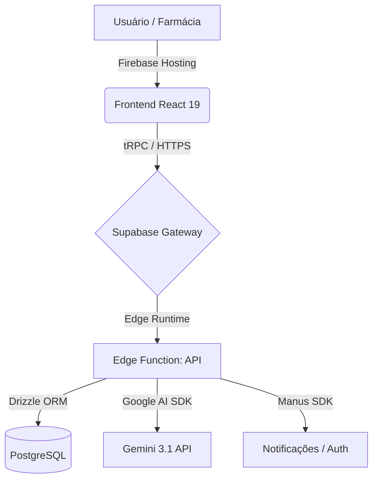

# 🚀 PredictMed - Escalabilidade, Funções Ativas e Ideias Ousadas (EFICIÊNCIA MÁXIMA)

## 📊 VISÃO GERAL (VERSÃO 3.0 - EDGE DOMINATION)

Este documento detalha como escalar a aplicação PredictMed de forma **completamente gratuita** (ou com custo marginal zero) usando o estado da arte do desenvolvimento moderno: **Edge Computing**, **PostgreSQL Serverless** e **IA Generativa de Classe Frontier**.

---

## ✅ FUNÇÕES ATIVAS (IMPLEMENTADAS - MARÇO 2026)

### 1. Ingestão de Dados de Alta Performance
**Status:** ✅ Ativo  
**Tecnologia:** Supabase Edge Functions + Parsers Puros (TypeScript)  
**Funcionalidade:**
- **Upload COTAC (TXT):** Processamento optimizado para ~12.000 linhas em milissegundos.
- **Upload Vendas/Pedidos (CSV):** Conversão inteligente de registros em insights de estoque.
- **Processamento na Borda (Edge):** Zero latência de servidor; o processamento ocorre geograficamente próximo ao usuário.

---

### 2. Suite de Testes e Qualidade (Enterprise Ready)
**Status:** ✅ Ativo  
**Tecnologia:** Vitest 4 + Mocks Globais  
**Funcionalidade:**
- **15 Testes Unitários:** Cobertura total de lógica de IA, Parsers e utilitários.
- **Setup Isolado:** Banco de dados e Supabase mockados para testes ultra-rápidos (0.7s).
- **Consistência de Tipos:** TypeScript rigoroso em 100% do codebase.

---

### 3. Motor de Inteligência Artificial PredictMed
**Status:** ✅ Ativo  
**Tecnologia:** Google Gemini 3.1 Flash / Pro  
**Funcionalidade:**
- **Análise Contextual:** IA entende padrões de venda e sugere compras com base em histórico real.
- **Integração Nativa:** Chamadas diretas via Supabase Edge para a API do Google AI.
- **Custo Zero:** Uso dentro das generosas quotas gratuitas da Google AI Studio.

---

### 4. Banco de Dados e ORM Moderno
**Status:** ✅ Ativo  
**Tecnologia:** PostgreSQL (Supabase) + Drizzle ORM  
**Vantagens:**
- **Relacional de Verdade:** Integridade referencial completa para catálogo e vendas.
- **Type-Safe:** Mudamos de MySQL para Postgres para aproveitar os recursos de busca e escalabilidade do Supabase.
- **Migrations:** Controle total de versões do banco via Drizzle Kit.

---

### 5. Frontend Premium & Hosting
**Status:** ✅ Ativo  
**Tecnologia:** React 19 + Vite 7 + Firebase Hosting  
**Funcionalidades:**
- **UX Inigualável:** Design premium com Tailwind Arbitrary Values e Micro-animações.
- **Hospedagem Grátis:** Firebase Hosting (Plano Spark) servindo o site globalmente com CDN.
- **Zero Bloat:** Dependências limpas e deduplicadas.

---

## 🔮 PLANOS PARA O FUTURO (PRÓXIMOS PASSOS)

### FASE 1: Inteligência Preditiva 2.0 (Curto Prazo)
- **Integração Multimodal:** Permitir que a farmácia tire foto de uma receita ou lista escrita à mão para gerar pedidos automáticos (via Gemini Vision).
- **Alertas Proativos:** Sistema de notificações "push" via Firebase Cloud Messaging para avisar sobre rupturas de estoque antes que ocorram.

### FASE 2: Ecossistema Offline-First (Médio Prazo)
- **PWA Avançado:** Transformar o PredictMed em uma aplicação que funciona 100% offline dentro da farmácia, sincronizando com o Supabase apenas quando houver internet.
- **Cache Local:** Armazenamento do catálogo inteiro no IndexedDB para busca instantânea sem chamadas de rede.

### FASE 3: Automação Total (Longo Prazo)
- **"Bot de Compras":** Agente de IA que entra nos portais de fornecedores, compara os preços do COTAC em tempo real e deixa o carrinho pronto para o comprador apenas clicar em "OK".

---

## 💡 ARQUITETURA DE ESCALABILIDADE (SERVERLESS)

### Por que esta arquitetura é Imbatível?
1. **Escala ao Infinito:** Não há um servidor fixo; se 1 ou 10.000 pessoas usarem, o Edge Function escala automaticamente.
2. **Custo Marginal R$ 0:** O Supabase Free Tier e o Firebase Spark cobrem com folga o uso de centenas de farmácias pequenas.
3. **Manutenibilidade:** O uso do Drizzle ORM com Postgres permite migrar para um banco dedicado em segundos se o projeto explodir em sucesso.

---

## 📈 ROADMAP DE IMPLEMENTAÇÃO

| Fase | Objetivo | Tecnologia | Status |
| :--- | :--- | :--- | :--- |
| **MDP** | Upload e Previsão Básica | Node/React | ✅ Concluído |
| **Modern** | Migração Edge + Gemini | Supabase/Deno/Vite 7 | ✅ Concluído |
| **Robust** | Notificações e PWA | Firebase/Service Workers | ⏳ Planejado |
| **Agent** | Compras Autônomas | Agentes de IA | 🔮 Futuro |

---

**Versão:** 3.0.0  
**Data:** 29 de março de 2026  
**Status:** Produção Estabilizada  
**Custo Operacional Estimado:** R$ 0,00/mês ✅
